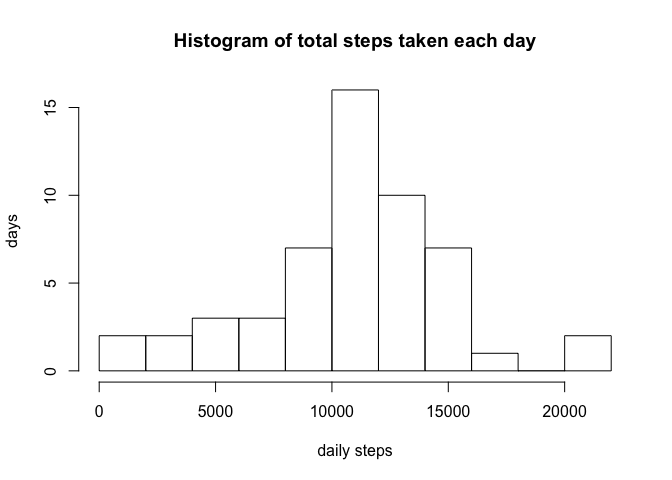
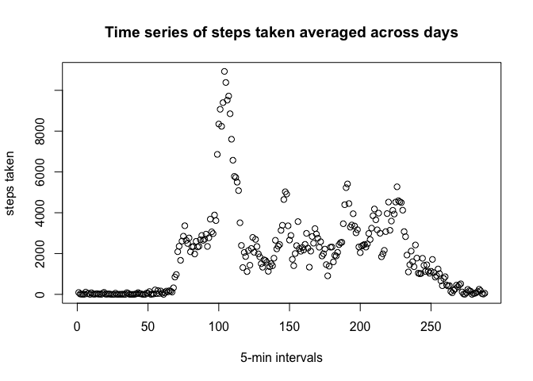
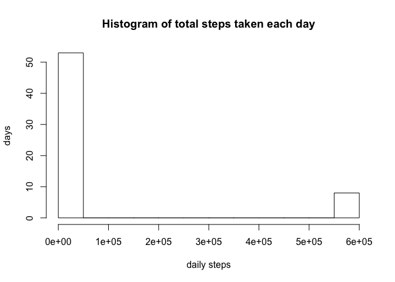

# Reproducible Research: Peer Assessment 1


## Loading and preprocessing the data
Load the activity data into dataframe "activity".

```r
setwd("~/Src/R/Repro_Research_coursera/RepData_PeerAssessment1/")
activity <- read.csv("activity.csv", header = TRUE)
summary(activity)
```

```
##      steps                date          interval     
##  Min.   :  0.00   2012-10-01:  288   Min.   :   0.0  
##  1st Qu.:  0.00   2012-10-02:  288   1st Qu.: 588.8  
##  Median :  0.00   2012-10-03:  288   Median :1177.5  
##  Mean   : 37.38   2012-10-04:  288   Mean   :1177.5  
##  3rd Qu.: 12.00   2012-10-05:  288   3rd Qu.:1766.2  
##  Max.   :806.00   2012-10-06:  288   Max.   :2355.0  
##  NA's   :2304     (Other)   :15840
```
The summary of the data reveals that there are many NA's.  remove incomplete (NA) rows from subsequent analysis.


```r
good <- complete.cases(activity)
summary(activity[good, ])
```

```
##      steps                date          interval     
##  Min.   :  0.00   2012-10-02:  288   Min.   :   0.0  
##  1st Qu.:  0.00   2012-10-03:  288   1st Qu.: 588.8  
##  Median :  0.00   2012-10-04:  288   Median :1177.5  
##  Mean   : 37.38   2012-10-05:  288   Mean   :1177.5  
##  3rd Qu.: 12.00   2012-10-06:  288   3rd Qu.:1766.2  
##  Max.   :806.00   2012-10-07:  288   Max.   :2355.0  
##                   (Other)   :13536
```


## What is mean total number of steps taken per day?
First find the total steps in each day

```r
mean(activity[good, "steps"])
```

```
## [1] 37.3826
```

```r
day_activity <- tapply(activity[good, "steps"], activity[good, "date"], sum )

day_activity
```

```
## 2012-10-01 2012-10-02 2012-10-03 2012-10-04 2012-10-05 2012-10-06 
##         NA        126      11352      12116      13294      15420 
## 2012-10-07 2012-10-08 2012-10-09 2012-10-10 2012-10-11 2012-10-12 
##      11015         NA      12811       9900      10304      17382 
## 2012-10-13 2012-10-14 2012-10-15 2012-10-16 2012-10-17 2012-10-18 
##      12426      15098      10139      15084      13452      10056 
## 2012-10-19 2012-10-20 2012-10-21 2012-10-22 2012-10-23 2012-10-24 
##      11829      10395       8821      13460       8918       8355 
## 2012-10-25 2012-10-26 2012-10-27 2012-10-28 2012-10-29 2012-10-30 
##       2492       6778      10119      11458       5018       9819 
## 2012-10-31 2012-11-01 2012-11-02 2012-11-03 2012-11-04 2012-11-05 
##      15414         NA      10600      10571         NA      10439 
## 2012-11-06 2012-11-07 2012-11-08 2012-11-09 2012-11-10 2012-11-11 
##       8334      12883       3219         NA         NA      12608 
## 2012-11-12 2012-11-13 2012-11-14 2012-11-15 2012-11-16 2012-11-17 
##      10765       7336         NA         41       5441      14339 
## 2012-11-18 2012-11-19 2012-11-20 2012-11-21 2012-11-22 2012-11-23 
##      15110       8841       4472      12787      20427      21194 
## 2012-11-24 2012-11-25 2012-11-26 2012-11-27 2012-11-28 2012-11-29 
##      14478      11834      11162      13646      10183       7047 
## 2012-11-30 
##         NA
```
Next find the mean of the days with good values


```r
mean(day_activity[complete.cases(day_activity)])
```

```
## [1] 10766.19
```

```r
median(day_activity[complete.cases(day_activity)])
```

```
## [1] 10765
```

```r
hist(day_activity[complete.cases(day_activity)], br=10, xlab="daily steps",ylab="days", main="Histogram of total steps taken each day")
```

 


## What is the average daily activity pattern?


```r
time_activity <- tapply(activity[good, "steps"], activity[good, "interval"], sum )
plot(time_activity, xlab="5-min intervals",ylab="steps taken", main="Time series of steps taken averaged across days")
```

 

What 5 minute interval gave the most steps?

```r
which.max(time_activity)
```

```
## 835 
## 104
```
The most activity in a 5 minute interval occurs at 8:35 in the morning.

## Imputing missing values
replace NA values with the mean number of steps for that time interval.

```r
activityTmp <- activity
dim(time_activity)
```

```
## [1] 288
```

```r
str(levels(activity$date))
```

```
##  chr [1:61] "2012-10-01" "2012-10-02" "2012-10-03" ...
```

```r
num_dates <- 61
new_steps <- rep(time_activity, times = num_dates)
activityTmp$steps <- new_steps
```
Now replace the NA's with the values in new_steps

```r
activityNew <- activity
activityNew[!good, ] = activityTmp[!good, ]
summary(activityNew)
```

```
##      steps                 date          interval     
##  Min.   :    0.0   2012-10-01:  288   Min.   :   0.0  
##  1st Qu.:    0.0   2012-10-02:  288   1st Qu.: 588.8  
##  Median :    0.0   2012-10-03:  288   Median :1177.5  
##  Mean   :  292.3   2012-10-04:  288   Mean   :1177.5  
##  3rd Qu.:   43.0   2012-10-05:  288   3rd Qu.:1766.2  
##  Max.   :10927.0   2012-10-06:  288   Max.   :2355.0  
##                    (Other)   :15840
```
Create a new histogram of steps taken each day after the steps are imputed.


```r
new_day_activity <- tapply(activityNew[, "steps"], activityNew[ , "date"], sum )
mean(new_day_activity)
```

```
## [1] 84188.07
```

```r
median(new_day_activity) 
```

```
## [1] 11458
```

```r
hist(new_day_activity, br=10, xlab="daily steps",ylab="days", main="Histogram of total steps taken each day")
```

 


## Are there differences in activity patterns between weekdays and weekends?
